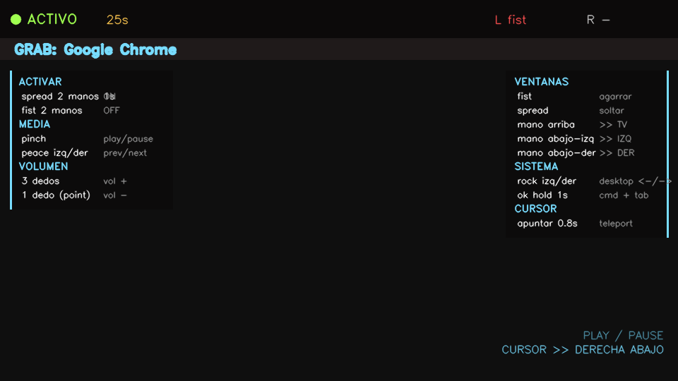

# nexo-hands

> Control macOS with hand gestures. Media (Spotify/YouTube/Apple Music), windows across multiple displays, desktops, and cursor handoff. Minority Report / Iron Man style.



## Why

I have three displays (main bottom-left, bottom-right, and a TV on top). Moving windows, controlling music, switching desktops, and teleporting the cursor around all that screen real estate with keyboard + mouse is clunky. This is my attempt at doing it with hand gestures alone.

Built by [Demian Olmedo](https://agentesnexo.com) for AgentesNexo using Claude Code.

## Features

- **9 stable hand gestures** detected in real time via MediaPipe, each mapped to a specific action.
- **Cross-screen grab**: point at a display, close your fist → you grab the topmost window on that screen automatically. No click needed.
- **Throw velocity**: flick your hand in a direction as you open to release, and the window follows that direction (not just the final hand position).
- **Cursor handoff**: while gestures are active, aim at another display for 0.8 s and the mouse cursor teleports to its center.
- **Smart cooldowns**: state transitions, gesture hold thresholds, and post-grab grace windows to eliminate the usual flaky-detection headaches.
- **Double-clap activation**: the mic is always listening for a double clap (Jarvis-style "hey, listen"). Falls back to a visual two-hand spread if you prefer.
- **Iron Man audio cues**: custom `welcome.wav` → 35 s of *Should I Stay or Should I Go* on activate, `seeya.wav` on deactivate.
- **Always-on-top HUD** so the preview stays visible even when you focus another app.
- **Side legend**: all gesture bindings rendered as cheat-sheet columns on both sides of the camera preview.

## Requirements

- macOS (heavy reliance on pyobjc + Accessibility + Core Graphics APIs)
- Python 3.10+
- Webcam
- Microphone (for double-clap detection; optional — visual activation works too)
- [Rectangle](https://rectangleapp.com/) optional, installed via `brew install --cask rectangle`

## Install

```bash
git clone https://github.com/YOUR_USERNAME/nexo-hands.git
cd nexo-hands
python3 -m venv venv
source venv/bin/activate
pip install -r requirements.txt
```

### Audio assets (bring your own)

For copyright reasons, the activation/deactivation audio is **not** in the repo. Drop these three files into `assets/`:

| File | What it does |
|---|---|
| `assets/welcome.wav` | Short sound on activation (~1 s, any short clip) |
| `assets/activation.mp3` | 35 s clip played right after welcome (any upbeat song) |
| `assets/seeya.wav` | Short sound on deactivation |

You can record your own in GarageBand or use any royalty-free clips.

### macOS permissions

On first launch macOS will prompt for:

1. **Camera access** — Allow.
2. **Microphone access** — Allow (for double clap).
3. **Accessibility** — required to move windows and send keystrokes. Open *System Settings → Privacy & Security → Accessibility* and add Terminal (or iTerm2). The app will show a red banner on screen if this is missing.

## Run

```bash
source venv/bin/activate
python main.py
```

The app starts in **STANDBY**. Activate with either:
- **Double clap** (microphone), or
- **Both hands open, palms forward (spread), held for 1 second**

When active, you hear the welcome audio and you have 30 s of idle time before auto-sleep.

Deactivate with **both hands fist** — you hear the goodbye audio.

## Gestures reference

### Activation / session state

| Action | Gesture |
|---|---|
| Activate | Double clap (mic) OR `spread` with both hands for 1 s |
| Deactivate | `fist` with both hands |

### Media control (Spotify, YouTube, Apple Music, any app playing audio)

| Gesture | Action |
|---|---|
| `pinch` | Play / pause toggle (universal media key) |
| `peace`, left hand | Previous track |
| `peace`, right hand | Next track |
| `3 fingers up` (index + middle + ring) | Volume up (hold to keep raising) |
| `point` (index only) | Volume down (hold to keep lowering) |

### Window management (3-screen layout)

Zones (using your camera as reference, frame flipped horizontally):
- **Upper third of frame** → top display (e.g. a TV)
- **Lower half, left** → bottom-left display
- **Lower half, right** → bottom-right display

| Gesture | Action |
|---|---|
| `fist`, single hand | Grab the top window of the display you are pointing at |
| `spread` (while grabbing) | Throw the grabbed window to the display your hand points at |
| `rock`, both hands | Undo the last window move |

### Desktops / apps

| Gesture | Action |
|---|---|
| `rock`, left hand | Switch to previous desktop (Ctrl+Left) |
| `rock`, right hand | Next desktop |
| `ok`, hold 1 s | Cmd+Tab to next app |

### Cursor handoff

Point at a display different from where your mouse currently lives for 0.8 s and the cursor teleports to its center. No click. Smart cooldown: won't re-teleport to the same display until your hand physically exits that zone.

## Architecture

- `gestures.py` — pure MediaPipe detector, 9 discrete gestures with simple geometric rules.
- `windows.py` — `pyobjc` + Accessibility API + Core Graphics for enumerating displays, finding topmost window on a display, and moving windows.
- `media.py` — `pynput` for HID media keys (works reliably with web-based media, which AppleScript key codes do not), `osascript` for desktop switching and volume.
- `audio.py` — `afplay` (native macOS) for non-blocking audio playback, `sounddevice` for double-clap detection with RMS peak + timing window heuristic.
- `hud.py` — `OpenCV` overlay drawing: status bar, side legends, action flash, drag overlay with trail, permission banner.
- `main.py` — the state machine: attention mode, grab lifecycle, cursor handoff, action cooldowns, flickering tolerance.

## Known limitations

- **No background daemon yet.** You need to keep the terminal running and the preview window visible. Converting to a menu-bar app with `rumps` is the obvious next step.
- **Camera always on** while active — ~5-10% CPU on M4. Negligible but not zero.
- **Single display with zero windows** triggers a fallback to `frontmost global` on grab. If you point at an empty TV, you might grab something from another display.
- **No calibration.** Gesture thresholds are hardcoded. If your hands are smaller/larger, detection may need tuning in `gestures.py`.

## Roadmap

Ideas I haven't shipped yet, in rough order of value:

1. Menu-bar app (`rumps`) so it runs without the preview window.
2. Per-app gesture profiles (`pinch` does different things in Chrome vs Spotify).
3. First-run calibration wizard (learn user-specific thresholds).
4. Ghost-preview during drag (semi-transparent rectangle follows hand before the real window moves).
5. Voice + gesture combos ("hey Jarvis" + `fist` = something specific).

## Credits

- Original DJ-control proof of concept: [PabloWasinger/dj-turbo](https://github.com/PabloWasinger/dj-turbo) — where the gesture detection started.
- MediaPipe (Google) for hand tracking.
- pynput, pyobjc, and the broader macOS Python ecosystem.

## License

MIT — see [LICENSE](LICENSE).
